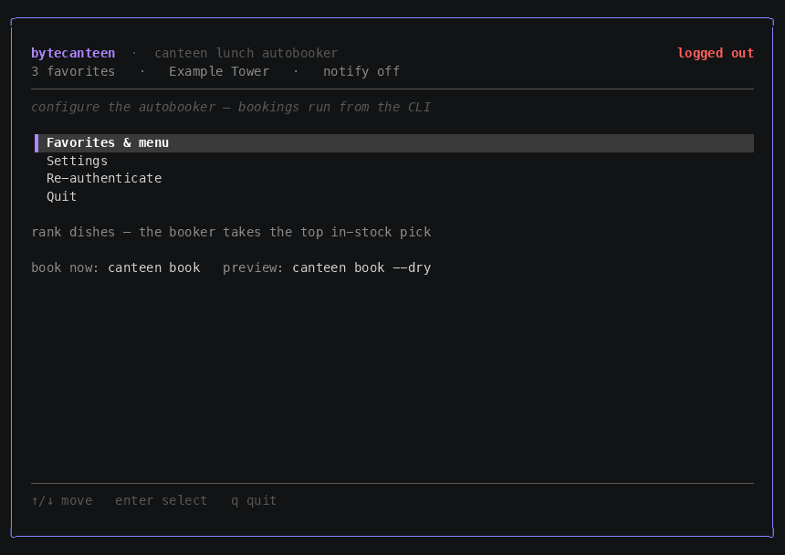

# canteen — a TUI canteen-lunch autobooker

Auto-books your canteen lunch by winning the weekly booking race the moment next
week's slots open. A single Go binary with a [Charm](https://charm.sh) TUI for
setup and a headless `book` command the scheduler fires.



> Personal automation for **your own** account and meals. The canteen ordering
> portal it talks to is deployment-specific and is configured entirely through
> environment variables (see [Configuration](#configuration)) — no endpoint is
> baked into the source.

## How it works

1. When next week's lunch slots open, each dish has a limited stock.
2. The job wakes the Mac (`pmset`) a few minutes early, then at the open time
   fetches each open weekday's menu, picks one dish per day (see
   [How it picks](#how-it-picks)), and submits them all in **one batch**.
3. If a pick is sold out the submit retries on a fresh menu — the now-zero pick is
   skipped and the next candidate takes its place, up to a 60-second deadline. You
   get a notification with the result.

### How it picks

For each day, selection follows a strict two-tier policy (`internal/selector`):

- **Tier 1 — your favorites (by dish).** The highest-ranked **in-stock** favorite
  wins, *regardless of vendor* — a favorite from a low-ranked stall still beats a
  non-favorite from your top stall. Name match is exact first, then substring.
- **Tier 2 — vendor fallback.** Only when **no favorite is in stock**: pick from
  your highest-ranked **vendor** that has anything in stock (vendors you haven't
  ranked come last). Within that vendor, take the **least-stocked** dish — the
  scarcest item is the canteen's best signal for the most-wanted one. Vendors are
  parsed from the dish name (`Vendor - Dish`); rank them in the TUI.

**Guarantee:** as long as *any* dish is in stock, something gets booked. The only
day it books nothing is one where the entire menu is sold out — even with zero
favorites and zero vendors configured, it falls through to the least-stocked dish
so you're not left hungry. (A vendor fallback or an unranked in-stock dish triggers
a "re-rank your favorites" nudge in the notification.)

## Install

### curl (latest release)

```bash
curl -fsSL https://raw.githubusercontent.com/algebananazzzzz/nybble/main/install.sh | sh
```

Downloads the latest macOS release, verifies its checksum, and installs `canteen`
to `/usr/local/bin` (or `~/.local/bin`).

### go install

```bash
go install github.com/algebananazzzzz/nybble/cmd/canteen@latest
```

### Manual

Grab a `canteen_<version>_darwin_<arch>.tar.gz` from
[Releases](https://github.com/algebananazzzzz/nybble/releases), verify it
against `checksums.txt`, extract, and move `canteen` onto your `PATH`.

### From source

```bash
make build      # produces ./canteen
```

## Configuration

The portal endpoints are **required** and read from the environment — the app
exits with a clear error if either is unset. Put them in your shell profile:

| Variable | Required | Purpose |
|---|---|---|
| `CANTEEN_API_BASE` | yes | Base URL of the ordering API, e.g. `https://<host>/<app-path>`. |
| `CANTEEN_LOGIN_URL` | yes | Page opened in the browser for the one-time SSO login. |
| `CANTEEN_LARK_TARGET` | no | Lark receive-id (`ou_…`/`oc_…`) for booking notifications. |
| `CANTEEN_BUILDING_CODE` / `_NAME` | no | Override the auto-detected building (see below). |
| `CANTEEN_PICKUP_CODE` / `_NAME` | no | Override the auto-detected pickup point. |
| `CANTEEN_MEAL_TYPE` | no | Meal slot to book; defaults to `lunch`. |

Your **building and pickup point** are deployment-specific. `canteen auth`
auto-detects them from the menu you open in the browser and writes them to
`config.json`, so you normally never set them by hand. The `CANTEEN_BUILDING_*` /
`CANTEEN_PICKUP_*` vars above override the detected values (or point the tool at a
different building) without re-running auth.

Either export them in your shell profile, or — easier — drop them in a `.env`
file. `canteen` loads `.env` from `./.env` then `~/.config/canteen/.env` on every
run (real environment variables still win; set `CANTEEN_ENV_FILE` to point
elsewhere). Copy [`.env.example`](.env.example) to get started:

```bash
mkdir -p ~/.config/canteen
cp .env.example ~/.config/canteen/.env
# edit ~/.config/canteen/.env with your real URLs
```

```dotenv
# ~/.config/canteen/.env
CANTEEN_API_BASE=https://<host>/<app-path>
CANTEEN_LOGIN_URL=https://<host>/<login-path>
```

A `.env` is gitignored — never commit a filled-in one. `canteen schedule on`
also snapshots the resolved values into the launchd job, so scheduled runs
resolve the same endpoints even with an empty shell.

## Requirements

- macOS (uses `launchd` and `pmset` for scheduling/wake).
- Go 1.26+ to build from source.
- [`playwright-cli`](https://www.npmjs.com/package/@playwright/cli)
  (`@playwright/cli`) installed globally — **required** for `canteen auth` (the
  one-time browser QR login):
  `npm i -g @playwright/cli && playwright-cli install chromium`.
- [`lark-cli`](https://www.npmjs.com/package/@larksuite/cli) (`@larksuite/cli`),
  **optional**, for notifications. Settings auto-detects it (binary plus a working
  bot identity, via a no-side-effect `bot/v3/info` check) and only then offers the
  Lark channel; messages send `--as bot`. Otherwise notifications are **Off**.

## Setup (first run)

```bash
canteen auth        # opens a browser; scan the SSO QR, wait for your canteen menu to
                    #   load (this is also how it detects your building), then press Enter
canteen             # launches the TUI (see "Using the TUI" below):
                    #   Favorites & menu -> rank dishes AND vendors (the fallback)
                    #   Settings         -> run day, booking days, open hour, notifications
canteen menu        # prints upcoming menus + grows the dish catalog (run a few times to seed it)
canteen book --dry  # dress rehearsal: shows what it WOULD book, places nothing
canteen schedule on # installs the weekly launchd job + pmset wake (asks sudo for pmset)
```

Config lives in `~/.config/canteen/`: `config.json` (settings), `favorites.json`
(your dish ranking), `vendors.json` (your vendor-fallback ranking), `catalog.json`
(every dish ever scanned), `excluded.json` (dishes you deleted), and `cookies.json`
(your SSO session — **keep it private**). `canteen clear` wipes all of these (your
`.env` endpoints stay).

## Using the TUI

`canteen` with no arguments opens the configurator. It only **sets things up** —
actual bookings run from `canteen book` (the scheduler). Every screen shows its
keys in a footer bar, so the list below is orientation, not memorization.

**Dashboard** (home) — `↑/↓` move, `enter` select, `q` quit. Five entries:
Favorites & menu, Settings, Re-authenticate (refresh an expired SSO session), Clear
all data (wipes local state after a `y` confirm), Quit.

**Favorites & menu** — three views, `tab` cycles between them:

- **Dishes** — your favorite ranking (`favorites.json`). Top of the list books
  first. `enter` grabs a row, then `↑/↓` moves it (or `Shift+J`/`Shift+K` to move
  without grabbing); `enter` again drops it. `s` saves. `d` deletes a dish (it
  won't come back on a rescan); `u` undoes the last delete. `r` rescans this week's
  live menu to pull in new dishes.
- **Vendors** — your fallback ranking (`vendors.json`), used only when no favorite
  dish is in stock (see [How it picks](#how-it-picks)). Same grab/move/save keys.
  Empty on first run — press `r` to scan the menu and populate it.
- **Deleted** — dishes you removed, so you can `d` restore one to the menu.

> Rank **both** dishes and vendors. Dishes drive the normal pick; vendors decide
> the fallback when your whole list is sold out. After ranking, press `s` in each
> view to save.

**Settings** — a short form: **Run day** (weekday the booker fires, when next
week's menu opens), **Book on days** (which weekdays to grab — `space` toggles),
**Open hour** (0–23, local), **Notify** (Lark or Off; Lark shows only when a
working `lark-cli` bot is detected), and **Lark target** (`ou_…` DM or `oc_…`
group, asked only if you pick Lark). `↑/↓` move, `enter` next field, `esc` cancels
without saving.

## The weekly flow

- The Mac wakes a few minutes before your **run day/time** and `canteen book`
  runs at the open time.
- It books one dish per weekday ticked in Settings (**Book on days**) using the
  two-tier policy above — your top in-stock favorite, else the vendor fallback.
  Booking is always live — there is no mode toggle.
- Notifications report: run started, the booked dishes (with a re-rank nudge when a
  fallback fired), and auth-expiry.

### Before you trust it

1. Run `canteen book --dry` — a preview that selects picks and prints the
   would-be batch but submits nothing. (`--dry` is the only non-live path.)
2. Optionally let the scheduled job fire once and check
   `~/Library/Logs/canteen.log` shows it woke, fetched live menus, and logged a
   sensible batch.
3. Wrong pick? Cancel it in the portal's own app.

## Commands

| Command | Does |
|---|---|
| `canteen` | Launch the TUI (state-aware dashboard). |
| `canteen auth` | One-time browser QR login -> saves cookies. |
| `canteen menu` | Print upcoming menus, update the dish catalog. |
| `canteen book [--dry]` | Run a booking (the scheduler calls this). `--dry` forces a no-submit preview. |
| `canteen schedule on/off` | Install / remove the weekly launchd job + pmset wake. |
| `canteen clear` (alias `logout`) | Wipe all local data (cookies, config, favorites, vendors, catalog) — keeps `.env` endpoints. `--yes` skips the prompt. |
| `canteen --version` | Print version, commit, and build date. |

## Versioning & releases

Every merge to `main` automatically bumps a semver tag and publishes a GitHub
Release (built by [GoReleaser](https://goreleaser.com)). The bump is computed
from commit messages:

- default: **patch** (`v1.2.3` -> `v1.2.4`)
- include `#minor` in a commit subject for a minor bump, `#major` for major
- include `#none` to skip a release for that merge

## Security

`~/.config/canteen/cookies.json` and `.auth/` hold a live SSO session — never
commit or share them (both are gitignored). This tool books only your own meals,
on your schedule, with a single prepared request.

## Layout

```
cmd/canteen      entry (cobra; no args -> TUI)
internal/
  config menu catalog selector booker   core booking logic (unit-tested vs fixtures)
  api session                           HTTP client + cookie session
  run                                   orchestrator + book/menu commands
  notify                                Lark notifications (lark-cli, --as bot)
  clock schedule                        race timing + launchd/pmset
  tui                                   Bubble Tea dashboard + screens
```

## License

[MIT](LICENSE)
